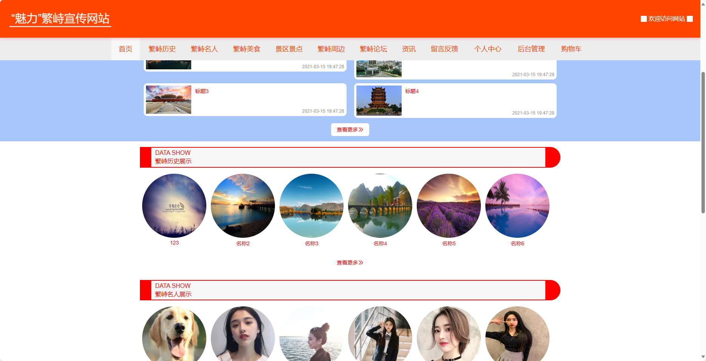
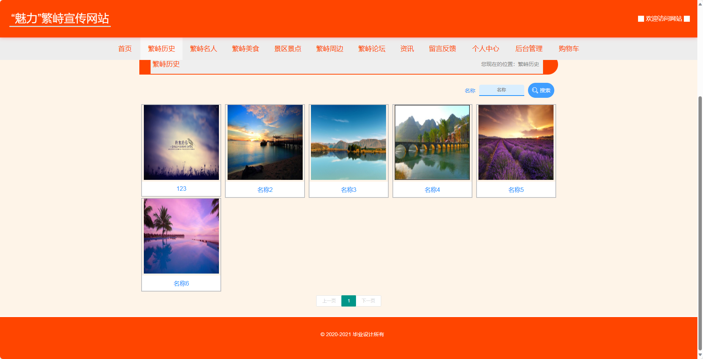
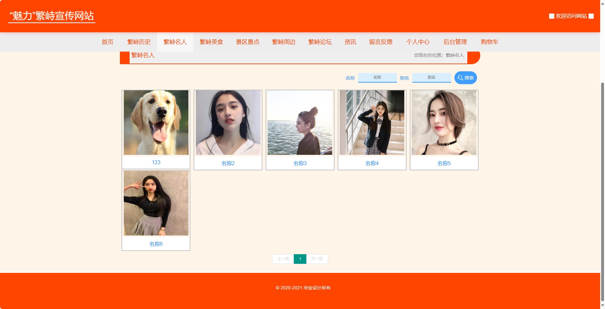
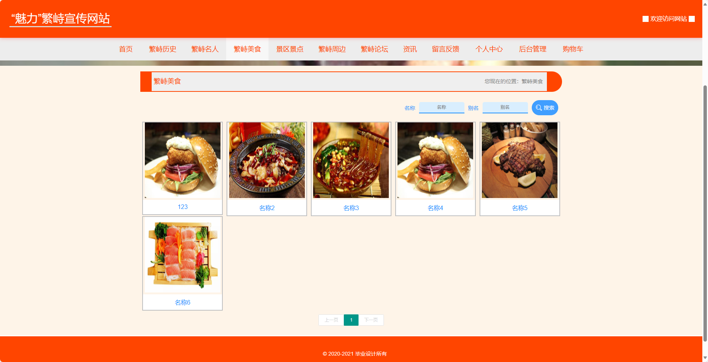
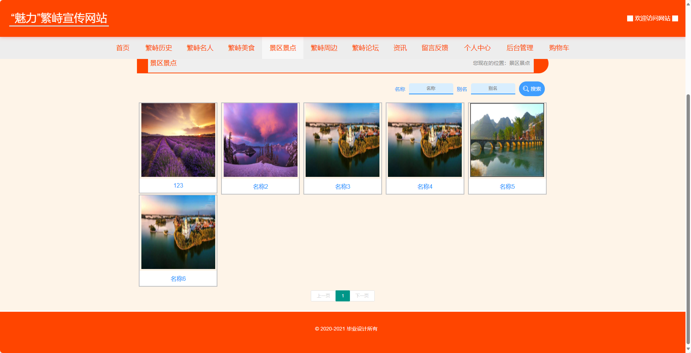
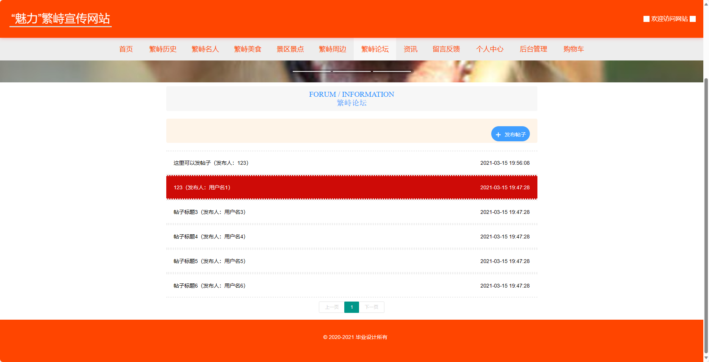
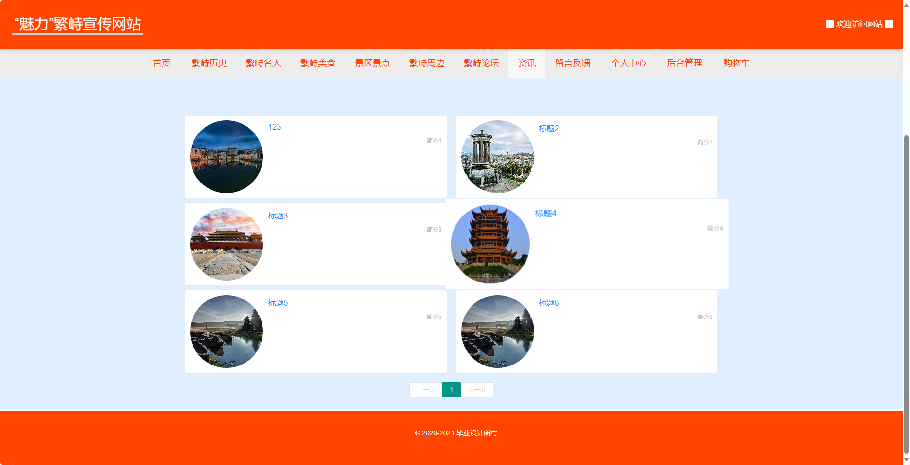

<h1 align="center">基于SSM框架实现的景区宣传系统【带文档】</h1>

 获取sql文件 QQ: 3645296857 QQ群: 978300347 

<h4> 需要视频演示可联系上述QQ，私发视频链接 </h4>

 获取更多高质量源码，请访问：[mzoo源码网](https://mzoocodes.com/)

## 简介

> 本代码来源于网络,仅供学习参考使用!
>
> <b style="color: dodgerblue"> 提供1.远程部署/2.修改代码/3.定制程序/4.文档指导/5.框架代码讲解、技术解答、代码讲解等服务 </b>
>
> 管理员登录地址：http://localhost:8081
>
> 管理员: admin 密码: 123456
>
> 用户首页地址：http://localhost:8080/ssmd3ysa/front/index.html
>
> 用户：用户2 密码: 123456

## 项目介绍

基于SSM框架实现的景区宣传系统【带文档】：前端 vue、axios、elementui，后端 spring、springmvc、mybatis，系统角色分为：管理员和用户。管理员在管理端对系统用户进行管理，可以发布景区宣传内容信息，发布周边商品等；用户可以在线上查看宣传内容，购买周边商品等。主要功能如下：

### 管理员
- 基本操作：登录、注册、修改密码、登出、修改个人信息
- 个人中心：用户可以管理个人信息、修改密码、查看订单等，方便用户管理和维护个人资料。
- 用户管理：筛选用户信息、添加用户信息、修改用户信息、删除用户信息、获取用户信息列表、查看用户信息详情、批量删除
- 景区历史管理：筛选景区历史信息、添加景区历史信息、修改景区历史信息、删除景区历史信息、获取景区历史信息列表、查看景区历史信息详情、批量删除、查看评论、回复评论、删除评论、查看评论详情
- 景区名人管理：筛选景区名人信息、添加景区名人信息、修改景区名人信息、删除景区名人信息、获取景区名人信息列表、查看景区名人信息详情、批量删除、查看评论、回复评论、删除评论、查看评论详情
- 景区美食管理：筛选景区美食信息、添加景区美食信息、修改景区美食信息、删除景区美食信息、获取景区美食信息列表、查看景区美食信息详情、批量删除、查看评论、回复评论、删除评论、查看评论详情
- 景区景点管理：筛选景区景点信息、添加景区景点信息、修改景区景点信息、删除景区景点信息、获取景区景点信息列表、查看景区景点信息详情、批量删除、查看评论、回复评论、删除评论、查看评论详情
- 景区周边管理：筛选景区周边信息、添加景区周边信息、修改景区周边信息、删除景区周边信息、获取景区周边信息列表、查看景区周边信息详情、批量删除、查看评论、回复评论、删除评论、查看评论详情
- 留言板管理：筛选留言板、修改留言板、删除景区周边信息、获取留言板信息列表、查看留言板信息详情、批量删除、查看评论、回复评论、删除评论、查看评论详情
- 论坛管理：筛选论坛信息、修改论坛内容、删除论坛信息、获取论坛信息列表、查看论坛信息详情、批量删除、发布论坛信息
- 收藏管理：筛选收藏信息、修改收藏内容、取消收藏、获取收藏列表、查看收藏详情、批量删除、新增收藏
- 管理员管理：筛选管理员信息、添加管理员信息、修改管理员信息、删除管理员信息、获取管理员信息列表、查看管理员信息详情、批量删除
- 轮播图管理：筛选轮播图信息、添加轮播图信息、修改轮播图信息、删除轮播图信息、获取轮播图信息列表、查看轮播图信息详情、批量删除、新增轮播图
- 资讯管理：筛选资讯信息、添加资讯信息、修改资讯信息、删除资讯信息、获取资讯信息列表、查看资讯信息详情、批量删除、新增资讯
- 订单管理：筛选订单信息、添加订单信息、修改订单信息、删除订单信息、获取订单信息列表、查看订单信息详情、批量删除、新增订单

### 用户
- 基本操作：登录、注册、修改密码、登出、修改个人信息
- 首页模块：展示“魅力”繁峙宣传网站的主要内容和推荐信息，包括繁峙的特色、旅游景点、美食等，吸引用户浏览和了解繁峙。
- 繁峙历史：介绍繁峙的历史沿革、文化传承和重要事件，帮助用户了解繁峙的历史背景。
- 繁峙名人：介绍繁峙出产的名人和有影响力的人物，包括艺术家、学者、企业家等，突显繁峙的人文底蕴。
- 繁峙美食：展示繁峙的传统美食和特色菜品，包括菜品的介绍、图片、口味特点等，吸引用户品尝和探索繁峙的美食文化。
- 景区景点：介绍繁峙的自然景观和旅游景点，包括山水风光、历史遗迹等，为用户提供游览繁峙的参考和指南。
- 繁峙周边：推荐繁峙周边的景点和旅游资源，包括周边城市、风景名胜等，为用户提供更广泛的旅游选择。
- 繁峙论坛：提供用户交流和分享的平台，用户可以在论坛中发布话题、发表观点，与其他用户进行互动和讨论。
- 资讯：提供繁峙宣传网站的最新资讯和动态，包括繁峙的新闻、活动等，帮助用户了解繁峙的最新动态。
- 留言反馈：用户可以在留言板上留下对繁峙的意见、建议或表达对繁峙的喜爱，提供反馈和互动的平台。
- 购物车：用户可以将感兴趣的商品加入购物车，方便统一管理和结算购物车中的商品。
- 订单管理：用户可以查看自己的订单信息，包括订单状态、支付情况等，并提供取消订单、确认收货等操作。

## 环境

- <b>IntelliJ IDEA 2020.3</b>

- <b>Mysql 5.7.26</b>

- <b>Maven 3.6.3</b>

- <b>Tomcat 9.0.41 | NodeJS 14.17.3</b>

- <b>JDK 1.8</b>

## 运行截图

